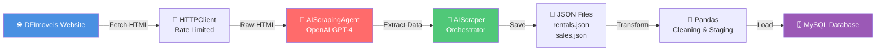
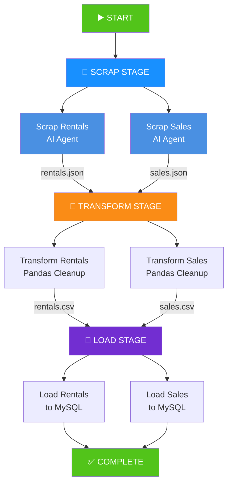
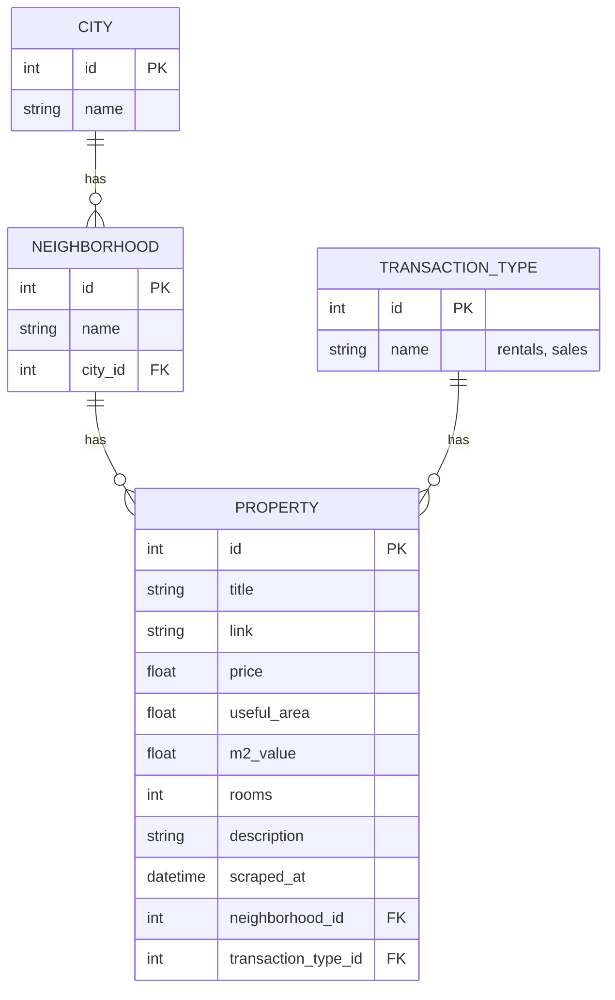
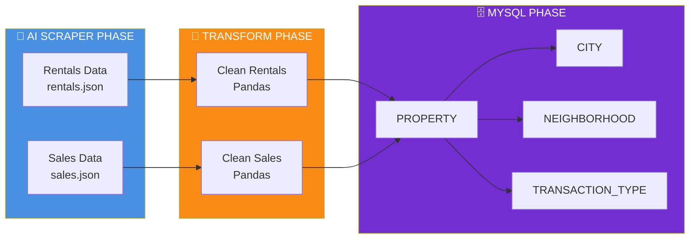

# real_estate_data_pipeline

🤖 Apache Airflow-based data pipeline using **OpenAI-powered AI Scraper** for intelligent web scraping.

## ⚡ Quick Links

- 📌 **[AI Scraper](ai_scraper/)** - AI-powered scraping module
- 📚 [Airflow DAGs](airflow/dags/) - Pipeline orchestration

## Tasks

This Airflow-based project executes the following tasks every day at 12 AM:

1. **Scrap data** from Brasília, Brazil real estate rentals and sales websites, **using AI agents (OpenAI)** 🤖
2. Save scraped data into JSON files, separating them by rentals or sales data
3. Clean the scraped data, using Pandas
4. Save clean data into CSV files for staging
5. Load data into MySQL tables, using SQLAlchemy

### Website Scraped
- https://www.dfimoveis.com.br

### Scraping Technology
- **AI Scraper with OpenAI** (semantic extraction) ✅

**Architecture:**



# DAG:

In Airflow, a DAG – or a Directed Acyclic Graph – is a collection of all the tasks you want to run, organized in a way that reflects their relationships and dependencies.

**Complete Data Pipeline DAG:**



# Airflow configured in a virtual machine
(https://airflow.apache.org/docs/apache-airflow/stable/start.html#)

The installation of Airflow is straightforward if you follow the instructions below. Airflow uses constraint files to enable reproducible installation, so using pip and constraint files is recommended.

Set Airflow Home (optional):

Airflow requires a home directory, and uses ~/airflow by default, but you can set a different location if you prefer. The AIRFLOW_HOME environment variable is used to inform Airflow of the desired location. This step of setting the environment variable should be done before installing Airflow so that the installation process knows where to store the necessary files.

export AIRFLOW_HOME=~/airflow
Install Airflow using the constraints file, which is determined based on the URL we pass:

AIRFLOW_VERSION=2.6.3

- Extract the version of Python you have installed. If you're currently using Python 3.11 you may want to set this manually as noted above, Python 3.11 is not yet supported.
PYTHON_VERSION="$(python --version | cut -d " " -f 2 | cut -d "." -f 1-2)"

CONSTRAINT_URL="https://raw.githubusercontent.com/apache/airflow/constraints-${AIRFLOW_VERSION}/constraints-${PYTHON_VERSION}.txt"
- For example this would install 2.6.3 with python 3.7: https://raw.githubusercontent.com/apache/airflow/constraints-2.6.3/constraints-3.7.txt

pip install "apache-airflow==${AIRFLOW_VERSION}" --constraint "${CONSTRAINT_URL}"
Run Airflow Standalone:

The airflow standalone command initializes the database, creates a user, and starts all components.

airflow standalone
Access the Airflow UI:

Visit localhost:8080 in your browser and log in with the admin account details shown in the terminal. Enable the example_bash_operator DAG in the home page.

Upon running these commands, Airflow will create the $AIRFLOW_HOME folder and create the “airflow.cfg” file with defaults that will get you going fast. You can override defaults using environment variables, see Configuration Reference. You can inspect the file either in $AIRFLOW_HOME/airflow.cfg, or through the UI in the Admin->Configuration menu. The PID file for the webserver will be stored in $AIRFLOW_HOME/airflow-webserver.pid or in /run/airflow/webserver.pid if started by systemd.

Out of the box, Airflow uses a SQLite database, which you should outgrow fairly quickly since no parallelization is possible using this database backend. It works in conjunction with the SequentialExecutor which will only run task instances sequentially. While this is very limiting, it allows you to get up and running quickly and take a tour of the UI and the command line utilities.

As you grow and deploy Airflow to production, you will also want to move away from the standalone command we use here to running the components separately. You can read more in Production Deployment.

Here are a few commands that will trigger a few task instances. You should be able to see the status of the jobs change in the example_bash_operator DAG as you run the commands below.

- run your first task instance
airflow tasks test example_bash_operator runme_0 2015-01-01
- run a backfill over 2 days
airflow dags backfill example_bash_operator \
    --start-date 2015-01-01 \
    --end-date 2015-01-02
If you want to run the individual parts of Airflow manually rather than using the all-in-one standalone command, you can instead run:

airflow db init

airflow users create \
    --username admin \
    --firstname Peter \
    --lastname Parker \
    --role Admin \
    --email spiderman@superhero.org

airflow webserver --port 8080

airflow scheduler

# MySQL Model

In the end, the model in MySQL is:



**Data Flow to Database:**



# Project Structure

```
real_estate_data_pipeline/
│
├── 📁 ai_scraper/                    # ⭐ AI-powered scraping module
│   ├── config.py                     # Configuration & constants
│   ├── http_client.py                # HTTP client with rate limiting
│   ├── ai_agent.py                   # OpenAI integration
│   ├── scraper.py                    # Main orchestrator
│   ├── main.py                       # CLI entry point
│   └── requirements.txt              # Dependencies (openai, requests)
│
├── 📁 airflow/dags/                  # Pipeline orchestration
│   ├── dag_pipeline_real_estate_ai.py    # Main DAG with AI Scraper
│   └── pipelines/                    # Data processing modules
│       ├── rentals.py                # Rentals transformation
│       ├── sales.py                  # Sales transformation
│       ├── database.py               # MySQL loading
│       └── models/                   # SQLAlchemy models
│
├── 📁 data/
│   ├── web/                          # Scraped JSON files
│   │   ├── rentals.json              # Raw rentals data
│   │   └── sales.json                # Raw sales data
│   └── staging/                      # Cleaned CSV files
│       ├── rentals.csv               # Staging rentals
│       └── sales.csv                 # Staging sales
│
├── .env.example                      # Environment template
├── .env                              # API keys (git ignored)
└── README.md                         # This file
```

# Key Components

| Component | Purpose | Technology |
|-----------|---------|------------|
| **AIScrapingAgent** | Intelligent data extraction | OpenAI GPT-4 |
| **HTTPClient** | Web requests with rate limiting | Python requests |
| **AIScraper** | Pipeline orchestration | Python |
| **Airflow DAG** | Task scheduling & monitoring | Apache Airflow |
| **Pandas** | Data cleaning & transformation | Python pandas |
| **SQLAlchemy** | Database ORM & loading | Python SQLAlchemy |
| **MySQL** | Data persistence | MySQL 8.0+ |

